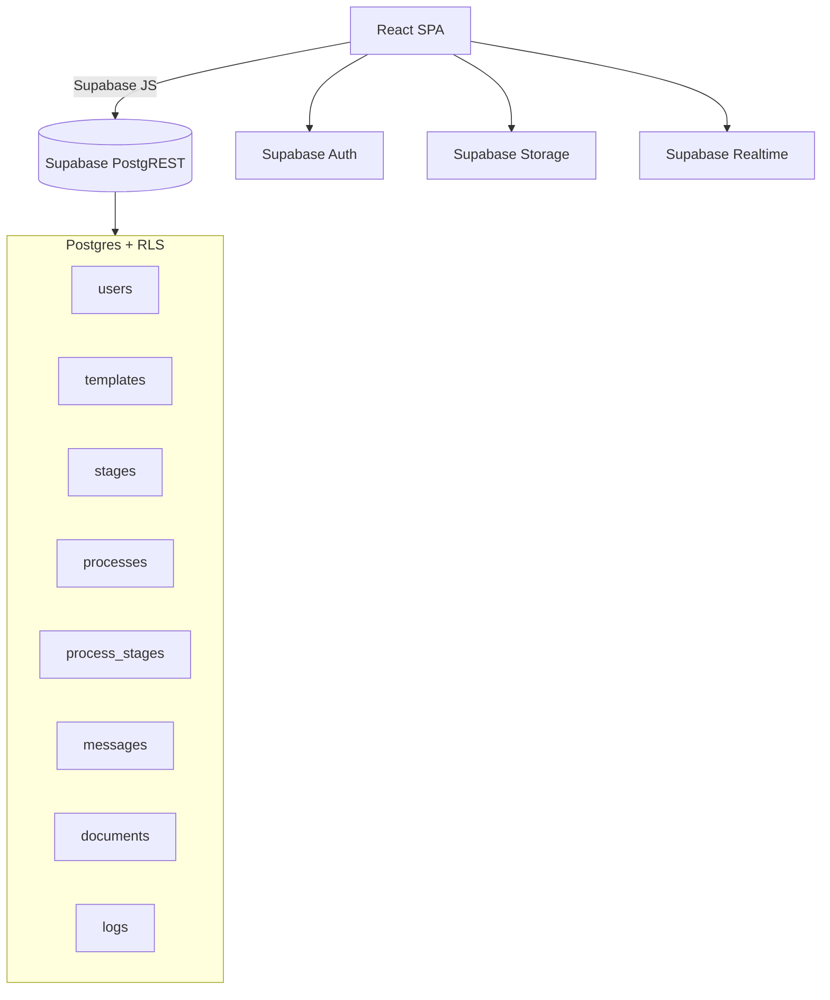

# Flowa — Gerenciamento de processos (PGBD 2025/2)


Sistema de workflow focado em modelagem de dados e prototipação funcional. Este README descreve o que foi implementado e como executar localmente.

## Sumário
- [Visão geral](#visão-geral)
- [Arquitetura e tecnologias](#arquitetura-e-tecnologias)
- [Funcionalidades implementadas](#funcionalidades-implementadas)
- [Estrutura de pastas (parcial)](#estrutura-de-pastas-parcial)
- [Banco de dados (resumo do modelo e políticas)](#banco-de-dados-resumo-do-modelo-e-políticas)
- [Configuração (.env)](#configuração-env)
- [Como rodar localmente](#como-rodar-localmente)
- [Configuração de storage (anexos)](#configuração-de-storage-anexos)
- [Fluxos do usuário](#fluxos-do-usuário)
- [Prints das telas](#prints-das-telas)

---

## Visão geral
O Flowa permite:
- Definir templates de processos (com etapas e ordem).
- Iniciar processos a partir de templates.
- Atribuir responsáveis por etapa e registrar mensagens e anexos.
- Acompanhar status com atualizações em tempo real.

Destaques desta entrega:
- Visualização de processo com persistência de status e atribuições no banco, atualizações em tempo real e regra “apenas quem está atribuído conclui”.
- Anexos com pré-visualização (imagem, PDF, vídeo, áudio), links assinados ou públicos e correção automática de caminhos legados.
- Gerenciamento de cargos (admin) com atribuição, renomeação e limpeza em massa, validando linhas afetadas.
- Páginas de ajuda (overview, atalhos, FAQ) e perfil (alterar nome e senha).
- Cadastro idempotente que evita erro de duplicidade na tabela `public.users`.

---

## Arquitetura e tecnologias
- Frontend: React + React Router + Vite.
- Estilos: CSS modular por página (tokens locais alinhados ao Templates.css).
- Plataforma: Supabase (Auth, Postgres, Storage, Realtime).
- Acesso a dados: Supabase JS Client.
- Segurança: RLS (Row-Level Security) no Postgres, com policies por tabela.
- Build/Dev: Node 18+ e Vite Dev Server.

Diagrama de alto nível:


---

## Funcionalidades implementadas
- Autenticação
  - Sessão via Supabase Auth.
  - Registro idempotente: normaliza e-mail, vincula `auth_id` se já existir perfil por e-mail e faz upsert por `auth_id`.
- Home (dashboard)
  - Resumo (Em andamento, Concluídos, Meus).
  - Filtros por status, template, período e busca textual.
  - Tabela com cabeçalho “sticky” e rolagem interna.
  - Seção “Atribuídos a mim” com rolagem interna.
- Templates
  - Criação de templates e etapas (ordem, nome, descrição).
  - Visualização de templates (badge de contagem e cabeçalho destacado).
- Processos
  - Novo processo (seleção de template, atribuição opcional, mensagem inicial, anexos).
  - Visualização do processo:
    - Lista de etapas com status e responsável.
    - Regras:
      - Primeira etapa com atribuição fixa (definida na criação).
      - Apenas o usuário atribuído pode concluir a etapa.
    - Ações:
      - Atribuir para mim, limpar atribuição e atribuir para outro usuário.
      - Concluir etapa (ativa a próxima pela ordem; finaliza na última).
    - Realtime:
      - Assinaturas em `process_stages` e `processes` para refletir mudanças ao vivo.
    - Documentos:
      - Upload no bucket configurável (padrão: `documents`).
      - Pré-visualização em modal (imagem/PDF/vídeo/áudio), abrir em nova aba e baixar.
      - Geração de URL assinada (ou pública, se o bucket for público).
      - Fallback para caminhos legados e correção automática do `caminho_arquivo`.
    - Mensagens por etapa e logs do processo.
- Cargos (admin)
  - Listar cargos agregados.
  - Atribuir cargo em massa para selecionados.
  - Renomear cargo (de → para).
  - Limpar cargo de todos os usuários com o cargo alvo.
  - Confirmação de linhas afetadas após updates (evita “sucesso” sem efeito por RLS).
- Páginas de suporte
  - Ajuda (visão geral, como funciona, FAQ e atalhos).
  - Perfil (alterar nome e senha; atalhos rápidos).

---

## Estrutura de pastas (parcial)
```
src/
  lib/
    supabase.js
  components/
    sidebar/
      sidebar.jsx
      sidebar.css
  pages/
    home/
      Home.jsx
      Home.css
    templates/
      Templates.jsx
      Templates.css
    processos/
      NovoProcesso.jsx
      NovoProcesso.css
      ProcessView.jsx
      ProcessView.css
    cargos/
      Cargos.jsx
      Cargos.css
    ajuda/
      Help.jsx
      Help.css
    perfil/
      Perfil.jsx
      Perfil.css
    auth/
      Login.jsx
      Login.css
assets/
  logo.svg
.env.local
```

---

## Banco de dados (resumo do modelo e políticas)
Relações principais:
- `templates` 1—N `stages`.
- `processes` N—1 `templates`.
- `process_stages` N—1 `processes` e N—1 `stages`.
- `messages`/`documents` N—1 `process_stage`.
- `users` vinculado a `criado_por`, `atribuido_para`, `enviado_por`, `feito_por`.

Estados utilizados:
- Etapas/Processos: “Pendente”, “Em andamento”, “Concluído”.

Unicidade e cadastro:
- `users`
  - Índices únicos recomendados: `unique (auth_id)` e `unique (lower(email))`.
  - Fluxo de cadastro: normaliza e-mail, tenta vincular `auth_id` se já existir por e-mail e, se não houver, faz upsert por `auth_id`.

Helpers de RLS (security definer):
- `current_app_user_id()`.
- `is_current_user_admin()`.
- `is_current_user_creator_of_process(p_process_id)`.
- `is_current_user_participant(p_process_id)` (criador, atribuído em qualquer etapa, ou admin).

Policies (resumo):
- `process_stages`
  - SELECT: `is_current_user_participant(process_id)`.
  - UPDATE (status): somente quando `atribuido_para = current_app_user_id()`.
  - UPDATE (atribuição): admin/chefe/gestor/super ou criador do processo.
- `processes`
  - SELECT/UPDATE: `is_current_user_participant(id)`.
- `documents`
  - INSERT: somente o próprio autor (`enviado_por = current_app_user_id()`).
  - SELECT: autor, criador do processo, qualquer atribuído no processo, ou admin.

Observação:
- Adequar nomes/cargos administrativos conforme a necessidade do ambiente.

---

## Configuração (.env)
Crie `./.env.local` com:
```
VITE_SUPABASE_URL=...               # URL do projeto Supabase
VITE_SUPABASE_ANON_KEY=...          # Anon Key do Supabase
VITE_STORAGE_BUCKET=documents       # Bucket para anexos
VITE_STORAGE_PUBLIC=false           # true = usa getPublicUrl; false = signed url
```

---

## Como rodar localmente
1) Pré-requisitos  
- Node 18+.  
- Projeto Supabase (URL + Anon Key).  
- Bucket no Storage.

2) Instalar dependências
```bash
npm install
```

3) Rodar em desenvolvimento
```bash
npm run dev
# acesso: http://localhost:5173
```

---

## Configuração de storage (anexos)
- Bucket padrão: `documents` (ajustável via `VITE_STORAGE_BUCKET`).
- Caminho de upload (compatível com objetos legados):
  - `process/<processId>/stage/<stageId>/<timestamp>-<nome_sanitizado.ext>`.
- Se o bucket for privado e você quiser links assinados:
  - Liberar `SELECT` e `INSERT` em `storage.objects` restritas ao bucket.
- Se preferir URL pública (sem assinatura):
  - Tornar o bucket público e definir `VITE_STORAGE_PUBLIC=true`.

Exemplo de policies mínimas (privado, para usuários autenticados):
```sql
create policy if not exists storage_select_documents
on storage.objects
for select
to authenticated
using (bucket_id = 'documents');

create policy if not exists storage_insert_documents
on storage.objects
for insert
to authenticated
with check (bucket_id = 'documents');

create policy if not exists storage_update_documents
on storage.objects
for update
to authenticated
using (bucket_id = 'documents')
with check (bucket_id = 'documents');

create policy if not exists storage_delete_documents
on storage.objects
for delete
to authenticated
using (bucket_id = 'documents');
```

Observações:
- A tabela `documents` guarda `caminho_arquivo` (chave no Storage), `nome_arquivo`, `enviado_por` e timestamps.
- A visualização do processo gera URL assinada (ou pública) e corrige caminhos antigos automaticamente quando possível.

---

## Fluxos do usuário
- Novo processo
  1. Escolher template.
  2. Conferir 1ª etapa sugerida.
  3. (Opcional) Atribuir responsável inicial.
  4. (Opcional) Mensagem inicial.
  5. (Opcional) Anexar arquivos.
  6. Criar processo → gera `processes`, copia etapas em `process_stages`, insere `messages`/`documents` e registra `logs`.

- Visualizar processo
  - Selecionar etapa → ver detalhes, mensagens e documentos.
  - Atribuir/remover/atribuir para mim (primeira etapa fixa).
  - Concluir etapa (apenas quem está atribuído), ativando a próxima ou finalizando o processo.
  - Atualizações em tempo real para status e atribuições.
  - Documentos: visualizar (modal), abrir e baixar.

- Home (dashboard)
  - Resumo rápido (contagens).
  - Filtros por status, template, período e busca textual.
  - Tabela principal com rolagem interna.
  - Seção “Atribuídos a mim” com rolagem interna.

- Cargos (admin)
  - Selecionar usuários e atribuir cargo.
  - Renomear cargo (de → para).
  - Limpar cargo de todos os usuários com o cargo alvo.
  - Validação de RLS: confirma linhas afetadas.

- Perfil
  - Alterar nome (persistido em `public.users`).
  - Alterar senha (Supabase Auth).
  - Atalhos (Meus processos, Templates, Cargos*).

- Ajuda
  - Visão geral do produto, “Como funciona” e FAQ.
  - Atalhos rápidos para ações comuns.

---

## Prints das telas
- Login  
  

- Home  
  

- Templates — visualização  
  

- Novo processo  
  

- Processo — visualização (documentos, mensagens, logs)  
  [Falta adicionar print atualizado]

- Cargos / Ajuda / Perfil  
  [Adicionar prints]

---
