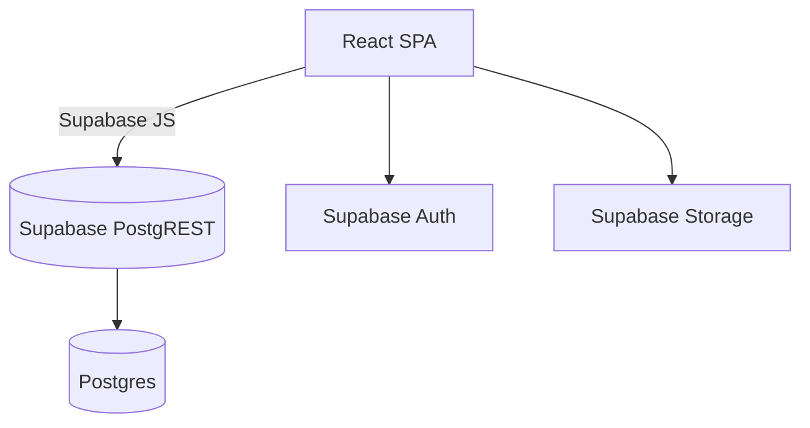

# Flowa — Gerenciamento de Processos (PGBD 2025/2)

Sistema de workflow acadêmico focado em modelagem de dados e prototipação funcional. Este README descreve exclusivamente o que já foi implementado até agora e como executar localmente.

## Sumário
- [Visão Geral](#visão-geral)
- [Arquitetura e Tecnologias](#arquitetura-e-tecnologias)
- [Funcionalidades Implementadas](#funcionalidades-implementadas)
- [Estrutura de Pastas (parcial)](#estrutura-de-pastas-parcial)
- [Banco de Dados](#banco-de-dados-resumo-do-modelo-atual)
- [Configuração (.env)](#configuração-env)
- [Como Rodar Localmente](#como-rodar-localmente)
- [Configuração de Storage (Anexos)](#configuração-de-storage-anexos)
- [Fluxos do Usuário](#fluxos-do-usuário)
- [Prints das Telas](#prints-das-telas)
- [Limitações Atuais](#limitações-atuais)
- [Próximos Passos](#roadmap-próximos-passos)

---

## Visão Geral
O “Flowa” permite:
- Definir Templates de Processos (com etapas e ordem)
- Iniciar Processos a partir de Templates
- Registrar Mensagens e Anexos por Etapa
- Consultar Processos com filtros e agrupamentos úteis

Implementação atual cobre:
- Home (Dashboard) com filtros, resumo e duas áreas com rolagem interna
- Criação/Visualização de Templates (páginas já existentes)
- Novo Processo (seleção de template, atribuição opcional, mensagem inicial, anexos)
- Login com tema escuro e UI moderna

---

## Arquitetura e Tecnologias
- Frontend: React + React Router + Vite
- Estilos: CSS modular por página (tokens locais, tema claro/escuro)
- Backend/Plataforma: Supabase (Auth, Postgres, Storage)
- Acesso a dados: Supabase JS Client
- Segurança: RLS (Row-Level Security) no Postgres + Policies por tabela
- Build/Dev: Node 18+, Vite dev server

Diagrama de alto nível:

```mermaid
graph TD
  UI[React SPA] -->|Supabase JS| API[(Supabase PostgREST)]
  UI --> Auth[Supabase Auth]
  UI --> Storage[Supabase Storage]
  API --> DB[(Postgres)]
```

---

## Funcionalidades Implementadas
- Autenticação
  - Sessão via Supabase Auth
  - Proteção de rota recomendada para “/processos/novo”
- Home (Dashboard)
  - Resumo (Em Andamento, Concluídos, Meus)
  - Filtros: Status, Template, Período (Hoje, 7 dias, Mês) e Busca
  - Tabela principal com scroll interno e cabeçalho “sticky”
  - Seção “Processos atribuídos a mim” com scroll interno
- Templates
  - Criação de Templates e etapas (ordem, nome, descrição)
  - Visualização de Templates (badge de contagem, cabeçalho com cor de destaque)
- Novo Processo
  - Selecionar Template e carregar 1ª etapa automaticamente
  - Atribuição opcional do responsável inicial
  - Mensagem inicial vinculada à primeira etapa (messages.process_stage_id)
  - Upload de anexos em bucket do Storage (tabela documents guarda metadados)
  - Geração das linhas em process_stages a partir do template
  - Log de criação (logs)


---

## Estrutura de Pastas (parcial)
```
src/
  lib/
    supabase.js                
  components/
    sidebar/
      sidebar.jsx
      sidebar.css
  pages/
    home/
      Home.jsx
      Home.css
    processos/
      NovoProcesso.jsx
      NovoProcesso.css
    auth/
      Login.jsx                
      Login.css
assets/
  logo.svg
.env.local                     
```

---

## Banco de Dados


Relações-chave:
- templates 1—N stages
- processes N—1 templates
- process_stages N—1 processes e N—1 stages
- messages/documents N—1 process_stages
- users relaciona-se com criado_por, atribuido_para, enviado_por, feito_por

Estados usados:
- Etapas/Processos: “Pendente”, “Em andamento”, “Concluído”

---

## Configuração (.env)
Criar `./.env.local` com:
```
VITE_SUPABASE_URL=...            # url do projeto supabase
VITE_SUPABASE_ANON_KEY=...       # anon key do supabase
VITE_STORAGE_BUCKET=documents    # bucket p/ anexos (ajustável)
```

---

## Como Rodar Localmente
1) Pré-requisitos  
- Node 18+  
- Projeto Supabase (URL + Anon Key)  
- Bucket no Storage (ver seção abaixo)

2) Instalar dependências
```bash
npm install
```

3) Rodar em desenvolvimento
```bash
npm run dev
# acesso: http://localhost:5173
```

---

## Configuração de Storage (Anexos)
- Criar um bucket (padrão usado: `documents`), ou ajustar `VITE_STORAGE_BUCKET` para um bucket existente
- Conceder policies no `storage.objects` permitindo upload/leitura para `authenticated` restritas ao bucket

Observações:
- A tabela `documents` guarda `caminho_arquivo` (chave no Storage), `nome_arquivo`, `enviado_por`, timestamps
- Upload ocorre no fluxo “Novo Processo”, pasta: `process/<processId>/stage/<processStageId>/...`

---

## Fluxos do Usuário
- Novo Processo
  1. Escolher Template
  2. Conferir 1ª Etapa sugerida
  3. (Opcional) Atribuir responsável
  4. (Opcional) Mensagem inicial
  5. (Opcional) Anexar arquivos
  6. Criar Processo → gera `processes`, copia etapas para `process_stages`, insere `messages` e `documents`, registra `logs`

- Home (Dashboard)
  - Resumo rápido (contagens)
  - Filtros por Status/Template/Período e Busca textual
  - Tabela principal com rolagem interna
  - Seção “Atribuídos a mim” com rolagem interna (linhas vindas de `process_stages` atribuidas ao usuário)

- Autenticação
  - Guard de rota recomendado para “/processos/novo” (somente logados)
  - É necessário existir `users` com `auth_id = auth.uid()` para criar processos

---


## Prints das Telas
- Login <br>
  

- Home
  

- Templates — Visualização  
  


- Novo Processo
  


---

## Limitações Atuais
- RLS/Policies: deve existir linha em `public.users` para o usuário logado (mapeado por `auth_id`) antes de criar processo
- Sem tela detalhada do Processo (histórico completo e encaminhamentos) — ainda em planejamento
- Regras de transição (`process_rules`) modeladas, mas não aplicadas no front

---

## Próximos Passos
- Tela de Detalhes do Processo (histórico de mensagens, anexos, transições)
- Encaminhamento entre Etapas baseado em `process_rules` (condições/valor, alçadas)
- Refinos de RLS/Policies e Triggers no Supabase
